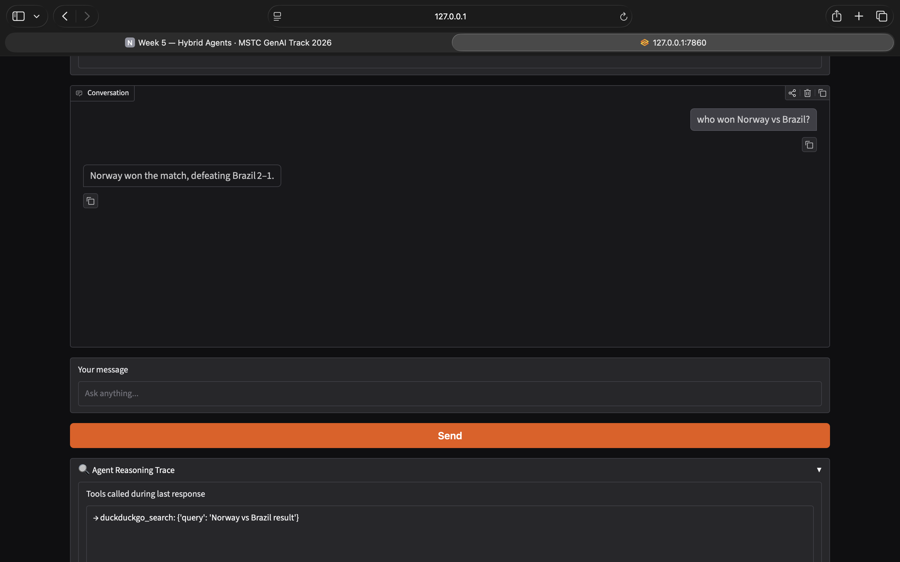

# 👁️ HybridSight

HybridSight is a hybrid AI agent built during **MSTC GenAI Track 2026 – Week 5**.

It combines:

- 📄 RAG (Retrieval-Augmented Generation) over uploaded PDFs
- 🌐 Web Search
- 📚 Wikipedia Search
- 🖼️ Vision (Image Understanding)

The agent automatically decides which tool to use based on the user's query.

---

# Features

## 📄 PDF Question Answering (RAG)

- Upload any PDF
- Indexes documents into ChromaDB
- Retrieves relevant chunks using semantic search
- Returns grounded answers with page numbers

---

## 🌐 Web Search

Uses DuckDuckGo for:

- Latest news
- Current events
- Recent information

---

## 📚 Wikipedia Search

Uses Wikipedia for:

- General knowledge
- Historical facts
- People
- Places
- Concepts

---

## 🖼️ Image Understanding

Upload an image and ask questions like:

- Describe this image
- What objects are present?
- What is happening here?
- What is the background color?

---

## 🤖 Intelligent Tool Routing

The ReAct agent automatically selects the correct tool based on the user's query.

---

## 🔍 Reasoning Trace

Every response includes the tool invocation trace showing:

- Tool name
- Tool input

This makes the agent's reasoning transparent.

---

# Tech Stack

- Python
- LangGraph
- LangChain
- Groq API
- Gradio
- ChromaDB
- HuggingFace Embeddings
- DuckDuckGo Search
- Wikipedia API

---

# Project Structure

```text
week5-hybridsight/
│
├── agent.py
├── app.py
├── tools_rag.py
├── tools_vision.py
├── requirements.txt
├── README.md
└── .env.example
```

---

# Installation

Clone the repository.

```bash
git clone <repo-url>
cd week5-hybridsight
```

Create a virtual environment.

```bash
python -m venv venv
```

Activate it.

Mac/Linux

```bash
source venv/bin/activate
```

Windows

```bash
venv\Scripts\activate
```

Install dependencies.

```bash
pip install -r requirements.txt
```

---

# Environment Variables

Create a `.env` file.

```env
GROQ_API_KEY=your_api_key_here
```

---

# Run

```bash
python app.py
```

The Gradio application will start locally.

---

# Test Cases

## Test Case 1 – PDF Question Answering

Upload a PDF and ask:

> What is the flow of the app from the uploaded PDF?

Expected:

- search_documents tool is called
- Answer comes from uploaded document

📷 Screenshot:

![RAG Test][RAG_Test]

---

## Test Case 2 – Web Search

Ask:

> who won the match norway vs brazil?

Expected:

- DuckDuckGo tool is called

📷 Screenshot:


---

## Test Case 3 – Wikipedia

Ask:

> Who is Einstein?

Expected:

- Wikipedia tool is called

📷 Screenshot:


---

## Test Case 4 – Vision

Upload an image.

Ask:

> Describe this image.

Expected:

- describe_image tool is called
- Image description is returned

📷 Screenshot:


---

# Future Improvements

- Multiple PDF support
- Better image reasoning
- Streaming responses
- Web citations
- Conversation memory across sessions
- Deploy to Hugging Face Spaces

